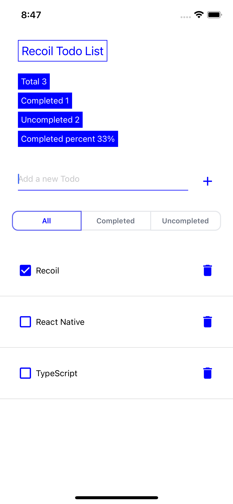

# ✅ Recoil Todo App (with React Native, TypeScript and Styled-component)

[Recoil 공식 문서](https://recoiljs.org/)에서 제공하는 todo 리스트 애플리케이션 예시를 
React Native와 TypeScript를 그리고 Styled-component를 사용해 만들었습니다.

>[Recoil 공식 문서 - Basic Tutorial](https://recoiljs.org/docs/basic-tutorial/intro)의 내용을 번역했습니다.
>예시 소스 코드가 React로 구현되어 있어 일부 수정되었음을 참고해주세요.

| iOS | Android |
| --- | --- |
|  |  |

Recoil API의 atoms, selectors, atom families, hooks를 사용했습니다.

### 구현 기능 리스트
- Todo 아이템 추가 
- Todo 아이템 수정 
- Todo 아이템 삭제 
- Todo 리스트 필터링 
- 유용한 통계 표시

## Type 설정
Todo 아이템의 타입을 아래와 같이 선언해줍니다.
```typescript
type Todo = {
  id: number;
  text: string;
  isComplete: boolean;
};
```

## Atoms
Atoms는 애플리케이션 상태의 "the source of truth"를 담고 있습니다. 
Todo 리스트의 "the source of truth"는 object 배열이 될 것이고, 각 object는 하나의 Todo 아이템에 해당 될 것입니다.

`atom()` 함수를 이용해서 `todoListState`라는 이름으로 Todo 리스트를 관리할 atom을 생성합니다.

```typescript
export const todoListState = atom<Todo[]>({
  key: 'todoListState', 
  default: [],
});
```

atom에 유니크한 키를 설정하고 default 값으로 빈 배열을 설정해 줍니다. 
이 atom의 내용을 읽어오기 위해 TodoList 컴포넌트에서 useRecoilValue() 훅을 이용합니다.
```typescript
function TodoList() {
  const todoList = useRecoilValue(todoListState);

  const renderItem: ListRenderItem<Todo> = useCallback(
    ({item}) => <TodoItem item={item} />,
    [],
  );

  return (
    <TodoListContainer>
      {/* <TodoListStats /> */}
      {/* <TodoListFilters /> */}
      <TodoItemCreator />
      <TodoFlatList data={todoList} renderItem={renderItem} />
    </TodoListContainer>
  );
}
```
주석 처리 된 컴포넌트는 다음 섹션에서 구현할 예정입니다.

새로운 Todo 아이템을 만들려면 `todoListState`의 내용을 업데이트 할 수 있는 setter 함수에 접근해야합니다.
`TodoItemCreator`컴포넌트에서 `useSetRecoilState()` 훅을 이용해서 setter를 사용할 수 있습니다.

```typescript
function TodoItemCreator() {
  const [inputValue, setInputValue] = useState<string>('');
  const [todoList, setTodoList] = useRecoilState(todoListState);

  const addItem = () => {
    const nextId =
      todoList.length > 0 ? Math.max(...todoList.map(todo => todo.id)) + 1 : 1;

    setTodoList(oldTodoList => [
      ...oldTodoList,
      {id: nextId, text: inputValue, isComplete: false},
    ]);
    setInputValue('');
  };

  return (
    <AddNewItemContainer>
      <NewItemTextInput
        value={inputValue}
        onChangeText={setInputValue}
        placeholder={'Add a new Todo'}
      />
      <IconButton name={'add'} onPress={addItem} />
    </AddNewItemContainer>
  );
}
```
기존 Todo 리스트를 기준으로 새로운 Todo 리스트를 만들기 위해서 setter 함수의 updater 형식을 사용하는 점을 유의하세요.

`TodoItem` 컴포넌트는 Todo 아이템의 값을 보여주는 동시에 text 값을 바꾸거나 삭제할 수 있습니다.
`todoListState`를 읽어오고, 아이템의 text를 업데이트 하고, 완료 여부를 표시하고, 삭제하기 위한 setter 함수를 불러오기 위해 `useRecoilState()`를 사용합니다.

```typescript
function TodoItem(props: Props) {
  const {item} = props;

  const [todoList, setTodoList] = useRecoilState(todoListState);
  const index = todoList.findIndex(listItem => listItem === item);

  const editItemText = (value: string) => {
    const newList = replaceItemAtIndex(todoList, index, {
      ...item,
      text: value,
    });
    setTodoList(newList);
  };

  const toggleItemCompletion = () => {
    const newList = replaceItemAtIndex(todoList, index, {
      ...item,
      isComplete: !item.isComplete,
    });
    setTodoList(newList);
  };

  const deleteItem = () => {
    const newList = removeItemAtIndex(todoList, index);
    setTodoList(newList);
  };

  return (
    <TodoItemContainer>
      <TodoTitleContainer>
        <CheckBoxButton
          name={!item.isComplete ? 'check-box-outline-blank' : 'check-box'}
          onPress={toggleItemCompletion}
        />
        <EditItemTextInput value={item.text} onChangeText={editItemText} />
      </TodoTitleContainer>
    <IconButton name={'delete'} onPress={deleteItem} />
  </TodoItemContainer>
  );
}

function replaceItemAtIndex(arr: Todo[], index: number, newValue: Todo) {
  return [...arr.slice(0, index), newValue, ...arr.slice(index + 1)];
}

function removeItemAtIndex(arr: Todo[], index: number) {
  return [...arr.slice(0, index), ...arr.slice(index + 1)];
}
```

이렇게 완벽하게 작동하는 Todo 리스트가 완성되었습니다. 
다음 섹션에서는 seletors를 사용해서 리스트를 더 높은 수준으로 만들 수 있는 방법에 대해서 알아봅니다.

## Seletors
selector는 파생된 상태(derived state)의 조각입니다. 
'파생된 상태'는 상태를 순수 함수를 통해 가공 후 나온 결과물, 즉, 기존 상태에서 새롭게 파생된 값으로 생각할 수 있습니다.

파생된 상태가 강력한 컨셉인 이유는 다른 데이터에 따라 역동적으로 변하는 데이터를 만들 수 있기 때문입니다.
Todo 리스트를 기준으로 다음을 '파생된 상태'로 생각해볼 수 있습니다.
- 필터링 된 Todo 리스트
  - 전체 Todo 리스트를 특정 기준에 따라 필터링해서 새로운 리스트를 파생하는 경우(에를 들어, 이미 완료 된 아이템만 필터링해서 조회)
- Todo 리스트 통계 자료
  - 리스트의 유용한 속성을 계산해서 총 아이템 개수나 완료된 아이템의 개수 완료율과 같은 값을 파생하는 경우

필터링 된 Todo 리스트를 사용하기 위해서 우리는 필터 기준을 먼저 설정하고 atom에 저장해야합니다. 
필터 옵션은 "Show All(모두 보기)", "Show Completed(완료된 아이템 보기)", "Show Uncompleted(완료되지 않은 아이템 보기)" 세 가지를 사용할 것입니다. 
```typescript
const todoListFilterState = atom({
  key: 'TodoListFilter',
  default: 'Show All',
});
```

`todoListFilterState`와 `todoListState`를 사용해서 필터에 따라 필터링 된 리스트를 파생하는 `filteredTodoListState` selector를 만듭니다.

```typescript
const filteredTodoListState = selector({
  key: 'filteredTodoListState',
  get: ({get}) => {
    const filter = get(todoListFilterState);
    const list = get(todoListState);

    switch (filter) {
      case 'Show Completed':
        return list.filter(item => item.isComplete);
      case 'Show Uncompleted':
        return list.filter(item => !item.isComplete);
      default:
        return list;
    }
  },
});
```

`filteredTodoListState`는 내부적으로 `todoListFilterState`와 `todoListState` 두 가지 값에 의존성을 갖기 때문에 둘 중 하나라도 값이 바뀌면 재실행 되게 됩니다. 

>컴포넌트 관점에서 보면 atom을 읽을 때 사용하는 훅으로 selector도 읽어 올 수 있습니다.
>그러나 일부 훅(useRecoilState())은 쓰기 가능 상태에서만 작동한다는 점을 유의해야 합니다.
>모든 atom은 쓰기 가능한 상태이지만, selector는 get과 set 속성을 둘 다 가지고 있는 selector의 경우에만 쓰기 가능한 상태로 간주됩니다. 
>이 주제에 대해서 더 많은 정보를 보고 싶다면 [Core Concepts](https://recoiljs.org/docs/introduction/core-concepts/) 페이지를 참고하세요.

필터링 된 Todo 리스트를 보여주는 것은 `TodoList` 컴포넌트에서 한 줄만 바꾸면 될 만큼 간단합니다.
```typescript
function TodoList() {
  // todoListState 에서 filteredTodoListState로 변경
  const todoList = useRecoilValue(filteredTodoListState);

  const renderItem: ListRenderItem<Todo> = useCallback(
    ({item}) => <TodoItem item={item} />,
    [],
  );

  return (
    <TodoListContainer>
      <TodoListStats />
      <TodoListFilters />
      <TodoItemCreator />
      <TodoFlatList data={todoList} renderItem={renderItem} />
    </TodoListContainer>
  );
}
```

모든 Todo 아이템이 UI에 표시되는 이유는 `todoListFilterState`의 default 값이 `"Show All(모두 보기)"`이기 떄문입니다.
필터를 바꾸기 위해서는 `TodoListFilters`를 구현해야 합니다.

```typescript
function TodoListFilters() {
  const [filter, setFilter] = useRecoilState(todoListFilterState);

  return (
    <Picker
      selectedValue={filter}
      onValueChange={itemValue => setFilter(itemValue)}>
      <Picker.Item label="All" value="Show All" />
      <Picker.Item label="Completed" value="Show Completed" />
      <Picker.Item label="Uncompleted" value="Show Uncompleted" />
    </Picker>
  );
}
```
> @react-native-picker/picker를 사용했습니다.

단 몇 줄의 코드로 우리는 필터링을 구현해냈습니다. 이제 같은 컨셉을 사용해 `TodoListStats` 컴포넌트를 구현합니다. 

우리는 다음 통계 값을 표시하고 싶습니다:
- Todo 아이템의 총 개수
- 완성된 아이템의 총 개수
- 완성되지 않은 아이템의 총 개수
- 완성된 아이템의 비율

통계 별로 selector를 따로 만들 수도 있지만, 좀 더 쉬운 접근은 우리가 필요한 데이터를 포함한 object를 리턴하는 하나의 selector를 만드는 방법입니다.
```typescript
const todoListStatsState = selector({
  key: 'todoListStatsState',
  get: ({get}) => {
    const todoList = get(todoListState);
    const totalNum = todoList.length;
    const totalCompletedNum = todoList.filter(item => item.isComplete).length;
    const totalUncompletedNum = totalNum - totalCompletedNum;
    const percentCompleted = totalNum === 0 ? 0 : totalCompletedNum / totalNum;

    return {
      totalNum,
      totalCompletedNum,
      totalUncompletedNum,
      percentCompleted,
    };
  },
});
```

`todoListState` 값을 읽어오기 위해서 다시 한 번 `useRecoilValue()`를 사용합니다.
```typescript
function TodoListStats() {
  const {totalNum, totalCompletedNum, totalUncompletedNum, percentCompleted} =
    useRecoilValue(todoListStatsState);

  const formattedPercentCompleted = Math.round(percentCompleted * 100);

  return (
    <>
      <Text>Total items: {totalNum}</Text>
      <Text>Items completed: {totalCompletedNum}</Text>
      <Text>Items not completed: {totalUncompletedNum}</Text>
      <Text>Percent completed: {formattedPercentCompleted}</Text>
  </>
  );
}
```

요약하자면, 우리는 아래의 요구 사항을 모두 만족하는 todo list app을 완성했습니다.
- Todo 아이템 추가
- Todo 아이템 수정
- Todo 아이템 삭제
- Todo 리스트 필터링
- 유용한 통계 표시

